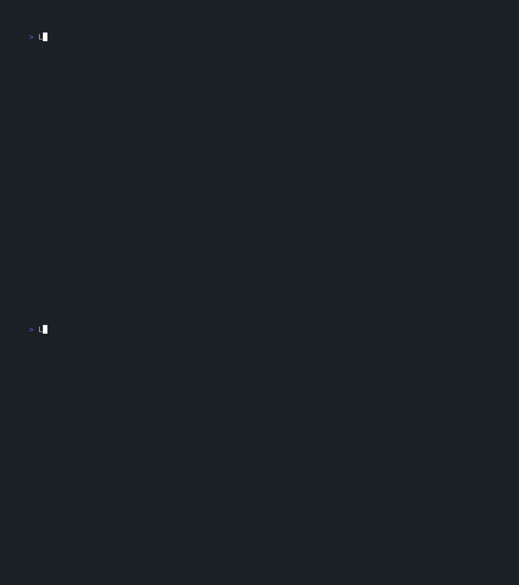

# portal


## Installation

### Homebrew

```bash
brew install SpatiumPortae/homebrew-portal/portal
```

### Manual

Either get the [latest release](https://github.com/ZinoKader/portal/releases/latest) and install it manually, _or_ run

```bash
curl -s https://raw.githubusercontent.com/ZinoKader/portal/master/scripts/install.sh | bash
```

> if permission denied for moving the files to /../bin, replace _" | bash"_ with _" | sudo bash"_ <br>
(the script is in the repo, so you can check it out before you blindly trust in it!)

## The application

`portal` is a fast and secure file transfer utility for sending files from one computer to any other computer. All communication beyond the initial client handshake is _encrypted_. If the sender and receiver can reach each other directly, the file transfer involves _no servers_. Otherwise the file transfer goes through a relay server which facilitates the connection, but _sees none of the data_.

### Sending files and folders

The file transfer starts by invoking the command from the sender side:

```bash
portal send <file1> <file2> <folder1> <folder2> ...
```

The application will output a temporary password on the format `1-inertia-elliptical-celestial`. 
The sender will communicate this password to the receiver over some secure channel.

### Receiving files and folders

The receiver would then issue the command:

```bash
portal receive 1-intertia-elliptical-celestial
```

The two clients will connect to each other and transfer the file(s)/folder(s).

### Extra: hosting your own rendezvous/relay server

To make connection establishment possible, portal makes use of a _rendezvous_ server. By default, a rendezvous server hosted at Digital Ocean is preconfigured, so you do not need to do anything. If you would like to host one on your own, build the server and start it with:

```bash
# specify port with -p or --port
portal serve --port 80
```

### Demo



## Features

portal provides:

- End-to-end encryption using [PAKE2](https://en.wikipedia.org/wiki/Password-authenticated_key_agreement) to negotiate a shared session-key
- Direct transfer of files if possible (e.g. sender and receiver are in the same local network)
- Fallback to a TURN-server (rendezvous-relay) for file transfer if the sender and receiver are behind NATs in different network
- Parallel gzip compression of files for faster and more efficient transfer

## Technical details

The connection between the sender and the server is negotiated using a intermediary server called `portal-rendezvous`. The `portal-rendezvous` server is used to negotiate a secure encrypted channel while never seeing the contents of files nor the temporary password.

The communication works as follows:

- `sender` application connects to `rendezvous-server`
- `rendezvous-server` allocates an id to the sender and sends over websocket to the `sender`
- `sender` outputs the password to the terminal, hashes the password and sends it to the `rendezvous-server`
- `receiver` hashes the password (which has been communicated over some secure channel) and the sends it to the `rendezvous-server`
- When both the `sender` and the `receiver` has sent the hashed password to the `rendezvous-server` the cryptographic exchange starts, during which the `rendezvous-server` relays messages from the `sender` to the `receiver` or vice versa
- Once the cryptographic exchange is done, every message sent by the `sender` and `receiver` is encrypted, and the `rendezvous-server` cannot decrypt them
- Now two things can happen: 
  - Either the `sender` and `receiver` are behind the same NAT, in which case the file transfer will be directly between the `sender` and `receiver`. In this case, the connection to the `rendezvous-server` will be closed
  - If they are not behind the same `NAT`, the transfer will fallback to go through the `rendezvous-server` which will continue to relay encrypted messages until the file transfer is completed

## Software used

- Go standard libraries
- [gorilla/websocket](https://github.com/gorilla/websocket)
- [shollz/pake](https://github.com/schollz/pake)
- [atotto/clipboard](https://github.com/atotto/clipboard)
- [charmbracelet/bubbles](https://github.com/charmbracelet/bubbles)
- [charmbracelet/bubbletea](https://github.com/charmbracelet/bubbletea)
- [charmbracelet/lipgloss](https://github.com/charmbracelet/lipgloss)
- [muesli/reflow](https://github.com/muesli/reflow)
- [klauspost/pgzip](https://github.com/klauspost/pgzip)
- [stretchr/testify](https://github.com/stretchr/testify)